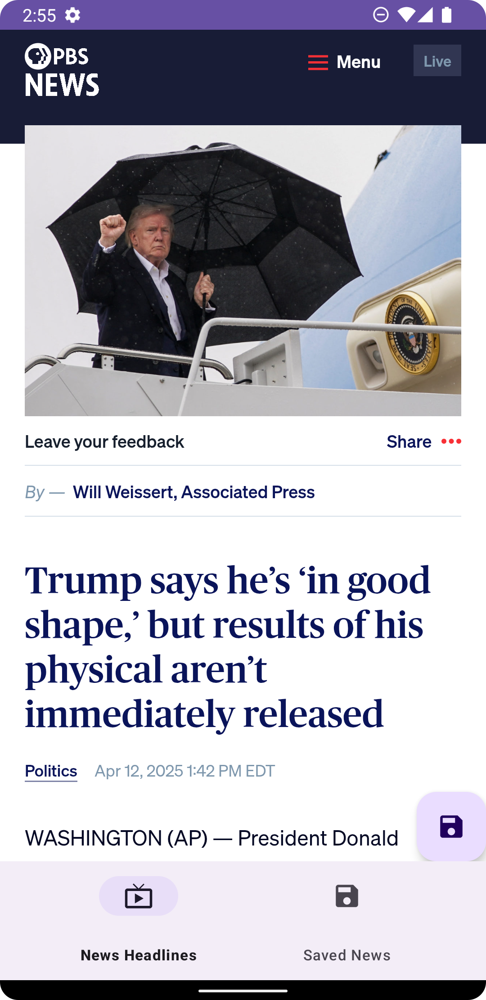
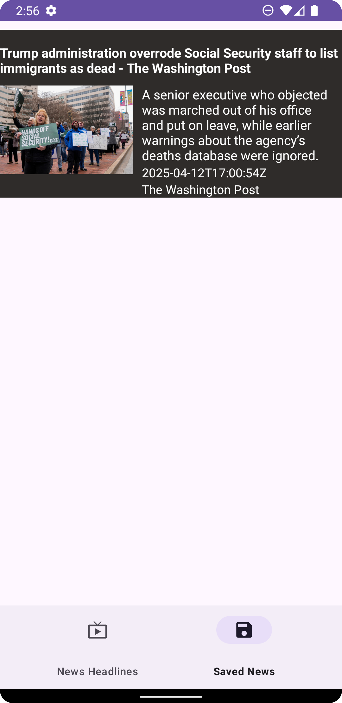

# News API Client

A Kotlin-based Android app for fetching and managing news articles using the NewsAPI.

## 🚀 Getting Started

### Prerequisites
1. **NewsAPI Key**:
  - Sign up for a free API key at [NewsAPI](https://newsapi.org/).
  - Copy your API key from the dashboard after registration.

2. **Configure the App**:
  - Create or edit the `gradle.properties` file in your project root.
  - Add the following lines (replace `YOUR_API_KEY` with your actual key):
    ```properties
    MY_KEY="YOUR_API_KEY"
    MY_URL="https://newsapi.org"
    ```  

### Installation
1. Clone the repository:
   ```bash
   git clone https://github.com/yourusername/News-API-Client.git
   ```  
2. Open the project in Android Studio.
3. Build and run the app.

---

## ✨ Features
- **Latest News**: Browse headlines from global news sources.
- **Search**: Find articles by keyword.
- **Pagination**: Auto-load more articles on scroll.
- **Save Articles**: Bookmark articles for offline reading.
- **Undo Delete**: Restore accidentally deleted saved articles.
- **Error Handling**: Graceful UI for network failures.

---

## 🛠️ Tech Stack
| Category           | Technologies                                                                 |  
|---------------------|-----------------------------------------------------------------------------|  
| **Language**        | Kotlin                                                                      |  
| **Architecture**    | MVVM                                                                        |  
| **Jetpack**         | LiveData, ViewModel, Navigation, Room, RecyclerView, ViewBinding            |  
| **Networking**      | Retrofit, OkHttp                                                            |  
| **DI**              | Dagger-Hilt                                                                 |  
| **Async**           | Coroutines, Flow                                                            |  
| **UI**              | Material Design                                                             |  

---

## 📸 Screenshots

| News Feed | Search | Saved Articles |  
|-----------|--------|----------------|  
|  |  |  |  

---


## 🙌 Acknowledgments
- Data provided by [NewsAPI](https://newsapi.org).
- UI components from [Material Design](https://material.io).
- Jetpack Libraries for streamlined Android development.